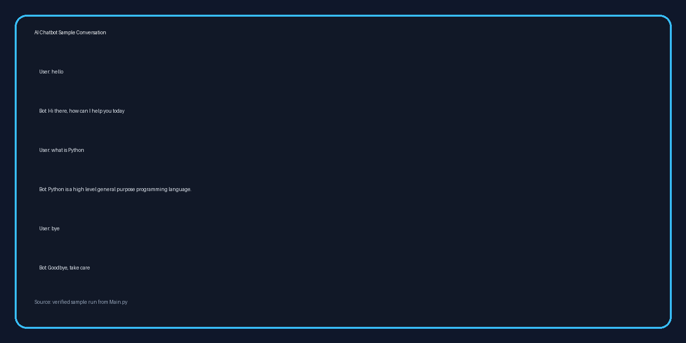

# AI ChatBot

A lightweight NLP-powered chatbot built in Python using `nltk`, `scikit-learn`, and a simple knowledge base about Python, NLP, and chatbots.

The project demonstrates a basic retrieval-style conversational system using:

- TF-IDF vectorization
- cosine similarity
- lemmatization
- keyword-based greeting and farewell handling

## Project Overview

This chatbot answers user questions by comparing the user's input against a built-in knowledge base. It uses a TF-IDF vectorizer to transform sentences into numerical vectors and then measures similarity using cosine similarity.

If the new sentence is very similar to an existing sentence, the chatbot returns the most relevant known answer. If the similarity score is too low, it responds with a fallback message.

## Features

- Greeting response support
- Farewell detection
- Simple “thank you” reply handling
- `clear` command to clear the terminal screen
- Knowledge-base question answering using NLP similarity
- Automatic NLTK resource download for missing models/data

## Demo Conversation

The following verified sample interaction is included as a visual reference:



## Project Structure

```text
AI_ChatBot/
├── Main.py          # Main chatbot implementation
├── conversation_sample.png  # Demo conversation image for README
└── README.md        # Project documentation
```

## Requirements

Make sure the following Python packages are installed:

- Python 3.x
- `nltk`
- `scikit-learn`
- `Pillow` (used for generating the sample image in this documentation workflow)

You can install them with:

```bash
pip install nltk scikit-learn pillow
```

## How It Works

### 1. Knowledge Base Setup

The chatbot uses a built-in string called `KNOWLEDGE_BASE` which contains short educational sentences related to:

- Python
- NLP
- Machine Learning
- Deep Learning
- Chatbots
- TF-IDF
- Cosine Similarity

### 2. Text Preprocessing

The system normalizes user input by:

- converting text to lowercase
- removing punctuation
- tokenizing text
- lemmatizing words using WordNetLemmatizer

### 3. Similarity Matching

The bot transforms the user input and the knowledge sentences into vectors using TF-IDF. It then computes cosine similarity and selects the sentence with the highest score.

### 4. Response Generation

The chatbot returns:

- a greeting response if the sentence contains a greeting
- a goodbye message when the user says farewell
- a knowledge-based answer when the similarity match is good
- a fallback response when the input is not understood

## Run the Project

From the project folder, run:

```bash
python Main.py
```

You will be prompted with:

```text
You:
```

Example inputs:

```text
hello
what is Python
bye
```

## Sample Behavior

A sample verified conversation is:

```text
User: hello
Bot: Hi there, how can I help you today
User: what is Python
Bot: Python is a high level general purpose programming language.
User: bye
Bot: Goodbye, take care
```

## Notes

- The first run may download NLTK data files automatically if required.
- This project is a simple educational implementation and is not a production-grade conversational AI system.
- It is best suited for learning NLP basics, text similarity, and chatbot design.

## License

This project is provided for educational purposes.

## Author

Created as a simple Python NLP chatbot project.
